```python
import numpy as np
from numpy.linalg import svd, matrix_rank
import pandas as pd
import matplotlib.pyplot as plt
from IPython import get_ipython
from util import (
    svdcomp,
    nextplot,
    plot_matrix,
    plot_xy,
    plot_cov,
    match_categories,
)  # see util.py
from sklearn.cluster import KMeans

%matplotlib notebook
```

# 1 Intuition on SVD


```python
M1 = np.array(
    [
        [1, 1, 1, 0, 0],
        [1, 1, 1, 0, 0],
        [1, 1, 1, 0, 0],
        [0, 0, 0, 0, 0],
        [0, 0, 0, 0, 0],
    ]
)

M2 = np.array(
    [
        [0, 0, 0, 0, 0],
        [0, 2, 1, 2, 0],
        [0, 2, 1, 2, 0],
        [0, 2, 1, 2, 0],
        [0, 0, 0, 0, 0],
    ]
)

M3 = np.array([[0, 0, 0, 0], [0, 1, 1, 1], [0, 1, 1, 1], [0, 1, 1, 1], [0, 1, 1, 1]])

M4 = np.array(
    [
        [1, 1, 1, 0, 0],
        [1, 1, 1, 0, 0],
        [1, 1, 1, 0, 0],
        [0, 0, 0, 1, 1],
        [0, 0, 0, 1, 1],
    ]
)

M5 = np.array(
    [
        [1, 1, 1, 0, 0],
        [1, 1, 1, 0, 0],
        [1, 1, 1, 1, 1],
        [0, 0, 1, 1, 1],
        [0, 0, 1, 1, 1],
    ]
)

M6 = np.array(
    [
        [1, 1, 1, 1, 1],
        [1, 1, 1, 1, 1],
        [1, 1, 0, 1, 1],
        [1, 1, 1, 1, 1],
        [1, 1, 1, 1, 1],
    ]
)
```

## 1a


```python
# YOUR PART
#Manually done in the report.
```

# 1b and 1c


```python
# Matrix M1
r = np.linalg.matrix_rank(M1)
u,s,vt = svd(M1,full_matrices = False)
S = np.diag(s)
print("Rank = {}".format(r))
print("\nLeft singular vector is \n")
print(u)
print("\nSingular values are \n")
print(s)
print("\nRight singular vector is\n")
print(np.transpose(vt))

```

    Rank = 1
    
    Left singular vector is 
    
    [[-5.77350269e-01  8.16496581e-01 -1.75121059e-16  0.00000000e+00
       0.00000000e+00]
     [-5.77350269e-01 -4.08248290e-01 -7.07106781e-01  0.00000000e+00
       0.00000000e+00]
     [-5.77350269e-01 -4.08248290e-01  7.07106781e-01  0.00000000e+00
       0.00000000e+00]
     [ 0.00000000e+00  0.00000000e+00  0.00000000e+00  0.00000000e+00
       1.00000000e+00]
     [ 0.00000000e+00  0.00000000e+00  0.00000000e+00  1.00000000e+00
       0.00000000e+00]]
    
    Singular values are 
    
    [3.00000000e+00 2.55806258e-17 2.11125548e-48 0.00000000e+00
     0.00000000e+00]
    
    Right singular vector is
    
    [[-0.57735027  0.81649658  0.          0.          0.        ]
     [-0.57735027 -0.40824829 -0.70710678  0.          0.        ]
     [-0.57735027 -0.40824829  0.70710678  0.          0.        ]
     [ 0.          0.          0.          0.          1.        ]
     [ 0.          0.          0.          1.          0.        ]]
    


```python
#best rank1 approximation
Xk = u[:,:1] @ np.diag(s[:1]) @ vt[:1,:]
plot_matrix(Xk)
```


```python
# Matrix M2
r = np.linalg.matrix_rank(M2)
u,s,vt = svd(M2,full_matrices = False)
S = np.diag(s)
print("Rank = {}".format(r))
print("\nLeft singular vector is \n")
print(u)
print("\nSingular values are \n")
print(s)
print("\nRight singular vector is\n")
print(np.transpose(vt))
```

    Rank = 1
    
    Left singular vector is 
    
    [[ 0.00000000e+00  0.00000000e+00  0.00000000e+00  0.00000000e+00
       1.00000000e+00]
     [-5.77350269e-01  8.16496581e-01 -2.62681588e-16  0.00000000e+00
       0.00000000e+00]
     [-5.77350269e-01 -4.08248290e-01 -7.07106781e-01  0.00000000e+00
       0.00000000e+00]
     [-5.77350269e-01 -4.08248290e-01  7.07106781e-01  0.00000000e+00
       0.00000000e+00]
     [ 0.00000000e+00  0.00000000e+00  0.00000000e+00  1.00000000e+00
       0.00000000e+00]]
    
    Singular values are 
    
    [5.19615242e+00 4.67036192e-17 3.64967471e-48 0.00000000e+00
     0.00000000e+00]
    
    Right singular vector is
    
    [[-0.          0.          0.          0.          1.        ]
     [-0.66666667  0.74535599  0.          0.          0.        ]
     [-0.33333333 -0.2981424  -0.89442719  0.          0.        ]
     [-0.66666667 -0.59628479  0.4472136   0.          0.        ]
     [ 0.          0.          0.          1.          0.        ]]
    


```python
#best rank1 approximation
Xk = u[:,:1] @ np.diag(s[:1]) @ vt[:1,:]
plot_matrix(Xk)
```


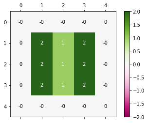


```python
# Matrix M3
r = np.linalg.matrix_rank(M3)
u,s,vt = svd(M3,full_matrices = False)
S = np.diag(s)
print("Rank = {}".format(r))
print("\nLeft singular vector is \n")
print(u)
print("\nSingular values are \n")
print(s)
print("\nRight singular vector is\n")
print(np.transpose(vt))
```

    Rank = 1
    
    Left singular vector is 
    
    [[ 0.00000000e+00  0.00000000e+00  0.00000000e+00  1.00000000e+00]
     [-5.00000000e-01  8.66025404e-01 -1.66533454e-16  0.00000000e+00]
     [-5.00000000e-01 -2.88675135e-01  8.16496581e-01  0.00000000e+00]
     [-5.00000000e-01 -2.88675135e-01 -4.08248290e-01  0.00000000e+00]
     [-5.00000000e-01 -2.88675135e-01 -4.08248290e-01  0.00000000e+00]]
    
    Singular values are 
    
    [3.46410162e+00 7.85046229e-17 3.26618704e-49 0.00000000e+00]
    
    Right singular vector is
    
    [[-0.          0.          0.          1.        ]
     [-0.57735027  0.81649658  0.          0.        ]
     [-0.57735027 -0.40824829 -0.70710678  0.        ]
     [-0.57735027 -0.40824829  0.70710678  0.        ]]
    


```python
#best rank1 approximation
Xk = u[:,:1] @ np.diag(s[:1]) @ vt[:1,:]
plot_matrix(Xk)
```


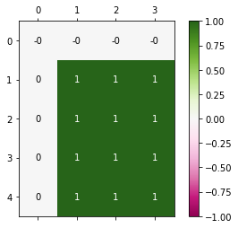


```python
# Matrix M4
r = np.linalg.matrix_rank(M4)
u,s,vt = svd(M1,full_matrices = False)
S = np.diag(s)
print("Rank = {}".format(r))
print("\nLeft singular vector is \n")
print(u)
print("\nSingular values are \n")
print(s)
print("\nRight singular vector is\n")
print(np.transpose(vt))
```

    Rank = 2
    
    Left singular vector is 
    
    [[-5.77350269e-01  8.16496581e-01 -1.75121059e-16  0.00000000e+00
       0.00000000e+00]
     [-5.77350269e-01 -4.08248290e-01 -7.07106781e-01  0.00000000e+00
       0.00000000e+00]
     [-5.77350269e-01 -4.08248290e-01  7.07106781e-01  0.00000000e+00
       0.00000000e+00]
     [ 0.00000000e+00  0.00000000e+00  0.00000000e+00  0.00000000e+00
       1.00000000e+00]
     [ 0.00000000e+00  0.00000000e+00  0.00000000e+00  1.00000000e+00
       0.00000000e+00]]
    
    Singular values are 
    
    [3.00000000e+00 2.55806258e-17 2.11125548e-48 0.00000000e+00
     0.00000000e+00]
    
    Right singular vector is
    
    [[-0.57735027  0.81649658  0.          0.          0.        ]
     [-0.57735027 -0.40824829 -0.70710678  0.          0.        ]
     [-0.57735027 -0.40824829  0.70710678  0.          0.        ]
     [ 0.          0.          0.          0.          1.        ]
     [ 0.          0.          0.          1.          0.        ]]
    


```python
#best rank1 approximation
Xk = u[:,:1] @ np.diag(s[:1]) @ vt[:1,:]
plot_matrix(Xk)
```


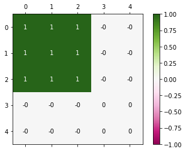


```python
# Matrix M5
r = np.linalg.matrix_rank(M5)
u,s,vt = svd(M5,full_matrices = False)
S = np.diag(s)
print("Rank = {}".format(r))
print("\nLeft singular vector is \n")
print(u)
print("\nSingular values are \n")
print(s)
print("\nRight singular vector is\n")
print(np.transpose(vt))
```

    Rank = 3
    
    Left singular vector is 
    
    [[-3.94102719e-01 -5.00000000e-01  3.07706105e-01  7.07106781e-01
       6.90381060e-17]
     [-3.94102719e-01 -5.00000000e-01  3.07706105e-01 -7.07106781e-01
      -9.22184114e-17]
     [-6.15412209e-01 -5.33929978e-17 -7.88205438e-01 -1.77706804e-16
       2.31803054e-17]
     [-3.94102719e-01  5.00000000e-01  3.07706105e-01  1.24164424e-16
      -7.07106781e-01]
     [-3.94102719e-01  5.00000000e-01  3.07706105e-01  1.31421212e-17
       7.07106781e-01]]
    
    Singular values are 
    
    [3.56155281e+00 2.00000000e+00 5.61552813e-01 1.94594768e-17
     7.10476982e-50]
    
    Right singular vector is
    
    [[-3.94102719e-01 -5.00000000e-01 -3.07706105e-01 -7.07106781e-01
       0.00000000e+00]
     [-3.94102719e-01 -5.00000000e-01 -3.07706105e-01  7.07106781e-01
      -1.59738305e-18]
     [-6.15412209e-01 -2.03023610e-16  7.88205438e-01  5.01493042e-17
      -3.74617773e-17]
     [-3.94102719e-01  5.00000000e-01 -3.07706105e-01 -3.87947165e-17
      -7.07106781e-01]
     [-3.94102719e-01  5.00000000e-01 -3.07706105e-01 -3.87947165e-17
       7.07106781e-01]]
    


```python
#best rank1 approximation
Xk = u[:,:1] @ np.diag(s[:1]) @ vt[:1,:]
plot_matrix(Xk)
```


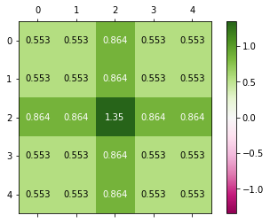


```python
# Matrix M6
r = np.linalg.matrix_rank(M6)
u,s,vt = svd(M6,full_matrices = False)
S = np.diag(s)
print("Rank = {}".format(r))
print("\nLeft singular vector is \n")
print(u)
print("\nSingular values are \n")
print(s)
print("\nRight singular vector is\n")
print(np.transpose(vt))
```

    Rank = 2
    
    Left singular vector is 
    
    [[-4.61939766e-01 -1.91341716e-01  8.66024213e-01  1.43585580e-03
       1.03570102e-17]
     [-4.61939766e-01 -1.91341716e-01 -2.90028476e-01  8.16016840e-01
      -1.08953675e-16]
     [-3.82683432e-01  9.23879533e-01  4.76434998e-17 -4.96673697e-17
       2.37675142e-18]
     [-4.61939766e-01 -1.91341716e-01 -2.87997869e-01 -4.08726348e-01
      -7.07106781e-01]
     [-4.61939766e-01 -1.91341716e-01 -2.87997869e-01 -4.08726348e-01
       7.07106781e-01]]
    
    Singular values are 
    
    [4.82842712e+00 8.28427125e-01 9.95090019e-17 2.18529703e-17
     1.03558444e-49]
    
    Right singular vector is
    
    [[-4.61939766e-01  1.91341716e-01  8.47659026e-01  1.77409629e-01
       0.00000000e+00]
     [-4.61939766e-01  1.91341716e-01 -4.49816411e-01  7.40044051e-01
      -8.19361931e-17]
     [-3.82683432e-01 -9.23879533e-01  4.08702351e-17 -4.00470283e-18
       7.96038953e-19]
     [-4.61939766e-01  1.91341716e-01 -1.98921308e-01 -4.58726840e-01
      -7.07106781e-01]
     [-4.61939766e-01  1.91341716e-01 -1.98921308e-01 -4.58726840e-01
       7.07106781e-01]]
    


```python
#best rank1 approximation
Xk = u[:,:1] @ np.diag(s[:1]) @ vt[:1,:]
plot_matrix(Xk)
```


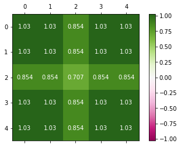


## 1c


```python
# You can use the functions svdcomp and plot_matrix from util.py
# YOUR PART
#Matrix M1
Xk = svdcomp(M1, range(1))
plot_matrix(Xk)
```


```python
#Matrix M2
Xk = svdcomp(M2, range(1))
plot_matrix(Xk)
```


```python
#Matrix M3
Xk = svdcomp(M3, range(1))
plot_matrix(Xk)
```


```python
#Matrix M4
Xk = svdcomp(M4, range(1))
plot_matrix(Xk)
```


```python
#Matrix M5
Xk = svdcomp(M5, range(1))
plot_matrix(Xk)
```


```python
#Matrix M6
Xk = svdcomp(M6, range(1))
plot_matrix(Xk)
```


## 1d


```python
# Another method to compute the rank is matrix_rank.
# YOUR PART
r = matrix_rank(M6)
r
```


    2


# 2 The SVD on Weather Data


```python
# Load the data
climate = pd.read_csv("data/worldclim.csv")
coord = pd.read_csv("data/worldclim_coordinates.csv")
lon = coord["lon"]
lat = coord["lat"]
```


```python
# Plot the coordinates
plot_xy(lon, lat)
```


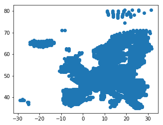


## 2a


```python
# YOUR PART
# Center the data (i.e., substract the column mean from each column). Store the result
# in X.
X = (climate - climate.mean())/climate.std(ddof=0)
```


```python
nextplot()
climate.hist(ax=plt.gca())
```

    C:\Users\sudha\Anaconda3\lib\site-packages\IPython\core\interactiveshell.py:2963: UserWarning: To output multiple subplots, the figure containing the passed axes is being cleared
      exec(code_obj, self.user_global_ns, self.user_ns)
    


    array([[<matplotlib.axes._subplots.AxesSubplot object at 0x000002DB84469828>,
            <matplotlib.axes._subplots.AxesSubplot object at 0x000002DB844CEF98>,
            <matplotlib.axes._subplots.AxesSubplot object at 0x000002DB844FE5F8>,
            <matplotlib.axes._subplots.AxesSubplot object at 0x000002DB84524C88>,
            <matplotlib.axes._subplots.AxesSubplot object at 0x000002DB84556358>,
            <matplotlib.axes._subplots.AxesSubplot object at 0x000002DB84556390>,
            <matplotlib.axes._subplots.AxesSubplot object at 0x000002DB845A9898>],
           [<matplotlib.axes._subplots.AxesSubplot object at 0x000002DB845D2F28>,
            <matplotlib.axes._subplots.AxesSubplot object at 0x000002DB846015F8>,
            <matplotlib.axes._subplots.AxesSubplot object at 0x000002DB84629C88>,
            <matplotlib.axes._subplots.AxesSubplot object at 0x000002DB8465C358>,
            <matplotlib.axes._subplots.AxesSubplot object at 0x000002DB846839E8>,
            <matplotlib.axes._subplots.AxesSubplot object at 0x000002DB846B50B8>,
            <matplotlib.axes._subplots.AxesSubplot object at 0x000002DB846DC898>],
           [<matplotlib.axes._subplots.AxesSubplot object at 0x000002DB84708E48>,
            <matplotlib.axes._subplots.AxesSubplot object at 0x000002DB84737470>,
            <matplotlib.axes._subplots.AxesSubplot object at 0x000002DB84761B00>,
            <matplotlib.axes._subplots.AxesSubplot object at 0x000002DB847921D0>,
            <matplotlib.axes._subplots.AxesSubplot object at 0x000002DB847B9860>,
            <matplotlib.axes._subplots.AxesSubplot object at 0x000002DB847E2EF0>,
            <matplotlib.axes._subplots.AxesSubplot object at 0x000002DB84400DD8>],
           [<matplotlib.axes._subplots.AxesSubplot object at 0x000002DB84391710>,
            <matplotlib.axes._subplots.AxesSubplot object at 0x000002DB843F2668>,
            <matplotlib.axes._subplots.AxesSubplot object at 0x000002DB842DD9B0>,
            <matplotlib.axes._subplots.AxesSubplot object at 0x000002DB83FE94E0>,
            <matplotlib.axes._subplots.AxesSubplot object at 0x000002DB840DE240>,
            <matplotlib.axes._subplots.AxesSubplot object at 0x000002DB84011438>,
            <matplotlib.axes._subplots.AxesSubplot object at 0x000002DB84223E80>],
           [<matplotlib.axes._subplots.AxesSubplot object at 0x000002DB8429A4A8>,
            <matplotlib.axes._subplots.AxesSubplot object at 0x000002DB83F070B8>,
            <matplotlib.axes._subplots.AxesSubplot object at 0x000002DB84069208>,
            <matplotlib.axes._subplots.AxesSubplot object at 0x000002DB8404A9E8>,
            <matplotlib.axes._subplots.AxesSubplot object at 0x000002DB83EB1978>,
            <matplotlib.axes._subplots.AxesSubplot object at 0x000002DB840F1B70>,
            <matplotlib.axes._subplots.AxesSubplot object at 0x000002DB8425FDA0>],
           [<matplotlib.axes._subplots.AxesSubplot object at 0x000002DB842562B0>,
            <matplotlib.axes._subplots.AxesSubplot object at 0x000002DB83FA6A58>,
            <matplotlib.axes._subplots.AxesSubplot object at 0x000002DB841ACF98>,
            <matplotlib.axes._subplots.AxesSubplot object at 0x000002DB84319668>,
            <matplotlib.axes._subplots.AxesSubplot object at 0x000002DB84027CF8>,
            <matplotlib.axes._subplots.AxesSubplot object at 0x000002DB83FD93C8>,
            <matplotlib.axes._subplots.AxesSubplot object at 0x000002DB83EE4A58>],
           [<matplotlib.axes._subplots.AxesSubplot object at 0x000002DB842A2128>,
            <matplotlib.axes._subplots.AxesSubplot object at 0x000002DB8434D7B8>,
            <matplotlib.axes._subplots.AxesSubplot object at 0x000002DB83E80E48>,
            <matplotlib.axes._subplots.AxesSubplot object at 0x000002DB84145518>,
            <matplotlib.axes._subplots.AxesSubplot object at 0x000002DB8439EBA8>,
            <matplotlib.axes._subplots.AxesSubplot object at 0x000002DB84264278>,
            <matplotlib.axes._subplots.AxesSubplot object at 0x000002DB84246908>]],
          dtype=object)


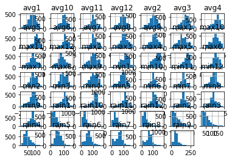


```python
nextplot()
climate.hist(column = climate.columns[[0,12,24,36]])
```


    array([[<matplotlib.axes._subplots.AxesSubplot object at 0x000002DB84885A20>,
            <matplotlib.axes._subplots.AxesSubplot object at 0x000002DB84E93160>],
           [<matplotlib.axes._subplots.AxesSubplot object at 0x000002DB84FB58D0>,
            <matplotlib.axes._subplots.AxesSubplot object at 0x000002DB85005048>]],
          dtype=object)


    <Figure size 432x288 with 0 Axes>


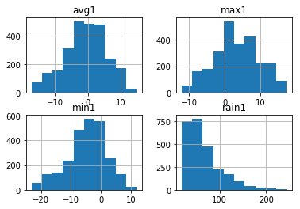


```python
# Plot histograms of attributes
nextplot()
X.hist(ax=plt.gca())

```

    C:\Users\sudha\Anaconda3\lib\site-packages\IPython\core\interactiveshell.py:2963: UserWarning: To output multiple subplots, the figure containing the passed axes is being cleared
      exec(code_obj, self.user_global_ns, self.user_ns)
    


    array([[<matplotlib.axes._subplots.AxesSubplot object at 0x000002DB8506C128>,
            <matplotlib.axes._subplots.AxesSubplot object at 0x000002DB860EB080>,
            <matplotlib.axes._subplots.AxesSubplot object at 0x000002DB86113710>,
            <matplotlib.axes._subplots.AxesSubplot object at 0x000002DB8613DDA0>,
            <matplotlib.axes._subplots.AxesSubplot object at 0x000002DB8616D470>,
            <matplotlib.axes._subplots.AxesSubplot object at 0x000002DB8616D4A8>,
            <matplotlib.axes._subplots.AxesSubplot object at 0x000002DB861C0630>],
           [<matplotlib.axes._subplots.AxesSubplot object at 0x000002DB861E6CC0>,
            <matplotlib.axes._subplots.AxesSubplot object at 0x000002DB86219400>,
            <matplotlib.axes._subplots.AxesSubplot object at 0x000002DB862419E8>,
            <matplotlib.axes._subplots.AxesSubplot object at 0x000002DB862740B8>,
            <matplotlib.axes._subplots.AxesSubplot object at 0x000002DB8629B748>,
            <matplotlib.axes._subplots.AxesSubplot object at 0x000002DB862C4DD8>,
            <matplotlib.axes._subplots.AxesSubplot object at 0x000002DB862F54A8>],
           [<matplotlib.axes._subplots.AxesSubplot object at 0x000002DB8631CB38>,
            <matplotlib.axes._subplots.AxesSubplot object at 0x000002DB86350208>,
            <matplotlib.axes._subplots.AxesSubplot object at 0x000002DB86377898>,
            <matplotlib.axes._subplots.AxesSubplot object at 0x000002DB8639EF28>,
            <matplotlib.axes._subplots.AxesSubplot object at 0x000002DB863CF5F8>,
            <matplotlib.axes._subplots.AxesSubplot object at 0x000002DB863F8C88>,
            <matplotlib.axes._subplots.AxesSubplot object at 0x000002DB8642A358>],
           [<matplotlib.axes._subplots.AxesSubplot object at 0x000002DB864539E8>,
            <matplotlib.axes._subplots.AxesSubplot object at 0x000002DB864860B8>,
            <matplotlib.axes._subplots.AxesSubplot object at 0x000002DB864AD748>,
            <matplotlib.axes._subplots.AxesSubplot object at 0x000002DB864D6DD8>,
            <matplotlib.axes._subplots.AxesSubplot object at 0x000002DB865084A8>,
            <matplotlib.axes._subplots.AxesSubplot object at 0x000002DB8652EB38>,
            <matplotlib.axes._subplots.AxesSubplot object at 0x000002DB86561208>],
           [<matplotlib.axes._subplots.AxesSubplot object at 0x000002DB8658A898>,
            <matplotlib.axes._subplots.AxesSubplot object at 0x000002DB865B2F28>,
            <matplotlib.axes._subplots.AxesSubplot object at 0x000002DB865E25F8>,
            <matplotlib.axes._subplots.AxesSubplot object at 0x000002DB8660AC88>,
            <matplotlib.axes._subplots.AxesSubplot object at 0x000002DB8663C358>,
            <matplotlib.axes._subplots.AxesSubplot object at 0x000002DB866649E8>,
            <matplotlib.axes._subplots.AxesSubplot object at 0x000002DB866980B8>],
           [<matplotlib.axes._subplots.AxesSubplot object at 0x000002DB866BE748>,
            <matplotlib.axes._subplots.AxesSubplot object at 0x000002DB866E7DD8>,
            <matplotlib.axes._subplots.AxesSubplot object at 0x000002DB867194A8>,
            <matplotlib.axes._subplots.AxesSubplot object at 0x000002DB86742B38>,
            <matplotlib.axes._subplots.AxesSubplot object at 0x000002DB86772208>,
            <matplotlib.axes._subplots.AxesSubplot object at 0x000002DB8679B898>,
            <matplotlib.axes._subplots.AxesSubplot object at 0x000002DB867C2F28>],
           [<matplotlib.axes._subplots.AxesSubplot object at 0x000002DB867F45F8>,
            <matplotlib.axes._subplots.AxesSubplot object at 0x000002DB8681EC88>,
            <matplotlib.axes._subplots.AxesSubplot object at 0x000002DB8684F358>,
            <matplotlib.axes._subplots.AxesSubplot object at 0x000002DB868769E8>,
            <matplotlib.axes._subplots.AxesSubplot object at 0x000002DB84ED2390>,
            <matplotlib.axes._subplots.AxesSubplot object at 0x000002DB868C8AC8>,
            <matplotlib.axes._subplots.AxesSubplot object at 0x000002DB868FB198>]],
          dtype=object)


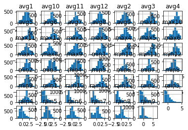


```python
nextplot()
X.hist(column = X.columns[[0,12,24,36]])
```


    array([[<matplotlib.axes._subplots.AxesSubplot object at 0x000002DB86DEE0B8>,
            <matplotlib.axes._subplots.AxesSubplot object at 0x000002DB870F8DD8>],
           [<matplotlib.axes._subplots.AxesSubplot object at 0x000002DB8701CE48>,
            <matplotlib.axes._subplots.AxesSubplot object at 0x000002DB8718C240>]],
          dtype=object)


    <Figure size 432x288 with 0 Axes>


## 2b


```python
# Compute the SVD of the normalized climate data and store it in variables U,s,Vt. What
# is the rank of the data?
# YOUR PART
U,s,Vt = svd(X)
r = np.linalg.matrix_rank(X)
r
```


    48


## 2c


```python
# Here is an example plot.
plot_xy(lon, lat, U[:, 0])
```


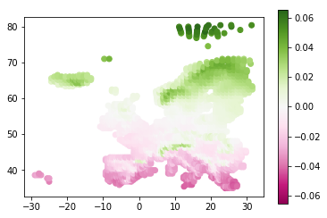


```python
plot_xy(lon, lat, U[:, 1])
```


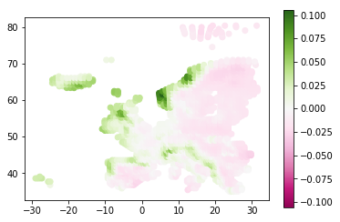


```python
plot_xy(lon, lat, U[:, 2])
```


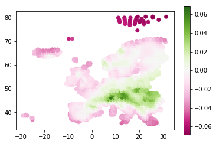


```python
plot_xy(lon, lat, U[:, 3])
```


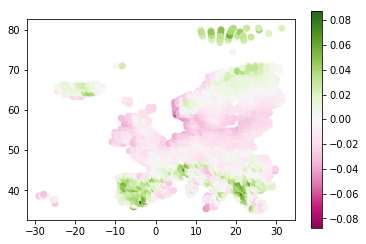


```python
plot_xy(lon, lat, U[:, 4])
```


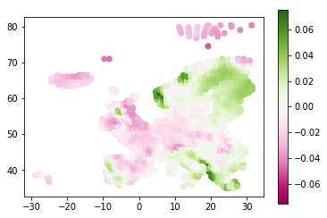


```python
# For interpretation, it may also help to look at the other component matrices and
# perhaps use other plot functions (e.g., plot_matrix).
# YOUR PART
#distribution of average temperature
plot_xy(lon, lat, X.iloc[:, 24])
```


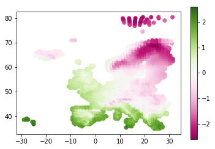


```python
#distribution of average rainfall
plot_xy(lon, lat, X.iloc[:, 36])
```


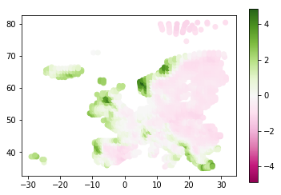


## 2d


```python
# Here is an example.
plot_xy(U[:, 0], U[:, 1], lat - np.mean(lat))
```


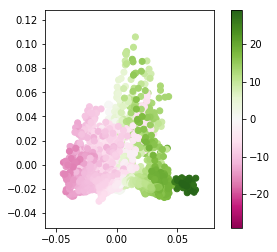


```python
plot_xy(U[:, 0], U[:, 1], lon - np.mean(lon))
```


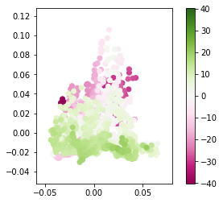


## 2e


```python
# 2e(i) Guttman-Kaiser
# YOUR PART
np.sum(s>1)
```


    37


```python
# 2e(ii) 90% squared Frobenius norm
# YOUR PART
diagsq = s*s
threshold = 0.9*np.sum(diagsq)
sum_ = 0
index = 0
while(sum_< threshold):
    sum_ += diagsq[index]
    index += 1

index
```


    3


```python
# 2e(iii) scree test
# YOUR PART
plt.plot(diagsq)
plt.scatter(range(len(diagsq)),diagsq)
plt.xlabel('index')
plt.ylabel('squared singular value')

```


    Text(0,0.5,'squared singular value')


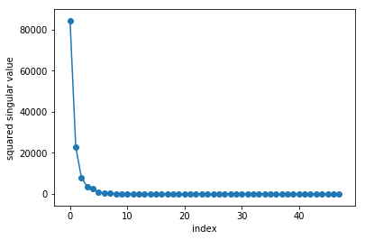


```python
# 2e(iv) entropy
# YOUR PART
dim = min(len(U),len(Vt))
fk = diagsq/np.sum(diagsq)
E = (-1/np.log(dim))*np.sum(fk*np.log(fk))

sum_ = 0
index = 0
while(sum_< E):
    sum_ += fk[index]
    index += 1

index
```


    1


```python
# 2e(v) random flips
# Random sign matrix: np.random.choice([-1,1], X.shape)
# YOUR PART
rand = np.random.choice([-1,1], X.shape)
S = np.diag(s)
result = np.zeros(48)
for k in range(0,48):   
    Xk = svdcomp(X,range(k))
    
    res = X-Xk
    res_hat = res*rand
    
    result[k] = (np.linalg.norm(res,ord= 2) - np.linalg.norm(res_hat,ord= 2))/np.linalg.norm(res,ord = 'fro')

plt.plot(result)
plt.xlabel('size-k truncation')
plt.ylabel('Difference after random flip')
```


    Text(0,0.5,'Difference after random flip')


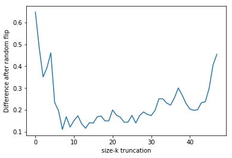


```python
# 2e What, if any, of these would be your choice?
# YOUR PART
```

## 2f


```python
# Here is the empty plot that you need to fill (one line per choice of k: RSME between
# original X and the reconstruction from size-k SVD of noisy versions)
# YOUR PART
def rmse(A,A_hat):
       return (1/np.sqrt(A.shape[0]*A.shape[1]))*(np.linalg.norm(A-A_hat,ord = 'fro'))
   
ks = [1,2,5,10,48]
eps = [0,0.5,1,1.5,2]

rmse_result = np.zeros([5,5])
nextplot()
i= 0
for k in ks:
    j = 0
    for epsilon in eps:
        X_noise = X + np.random.randn(*X.shape) * epsilon
        rmse_result[i][j] = rmse(X,svdcomp(X_noise,range(k)))
        j+=1
    plt.plot(np.arange(0,2.5,0.5),rmse_result[i],label='k ={}'.format(k))
    i+=1
    
plt.legend()
plt.xlabel(r"Noise level ($\epsilon$)")
plt.ylabel("Reconstruction RMSE vs. original data")
```


    Text(0,0.5,'Reconstruction RMSE vs. original data')


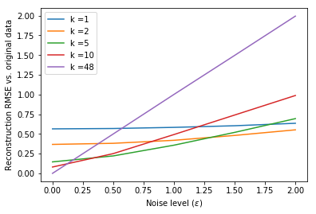


# 3 SVD and k-means


```python
# Cluster the normalized climate data into 5 clusters using k-means and store
# the vector giving the cluster labels for each location.
X_clusters = KMeans(5).fit(X).labels_
```

## 3a


```python
# Plot the results to the map: use the cluster labels to give the color to each
# point.
plot_xy(lon, lat, X_clusters)
plt.xlabel('Longitude')
plt.ylabel('Latitude')
```


    Text(0,0.5,'Latitude')


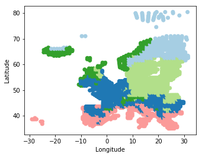


## 3b


```python
# YOUR PART HERE
plot_xy(U[:,0], U[:,1], X_clusters)
plt.xlabel("U1")
plt.ylabel("U2")
```


    Text(0,0.5,'U2')


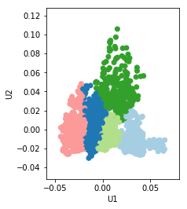


## 3c


```python
# Compute the PCA scores, store in Z (of shape N x k)
#k = 2
# YOUR PART HERE
```


```python
for k in [1,2,3]:
    Xk = svdcomp(X, components=range(k))
    U,s,Vt = svd(X)
    #Z = U*S = U*S*Vt*V
    Z = np.matmul(Xk,np.transpose(Vt))    
    # <codecell>
    # cluster and visualize
    Z_clusters = KMeans(5).fit(Z).labels_
    # match clusters as well as possible (try without)
    Z_clusters = match_categories(X_clusters, Z_clusters)
    nextplot()
    axs = plt.gcf().subplots(1, 2)
    plot_xy(lon, lat, X_clusters, axis=axs[0])
    plot_xy(lon, lat, Z_clusters, axis=axs[1])
    plt.savefig('3c{}.png'.format(k))
```


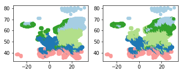


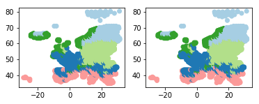


```python

```
